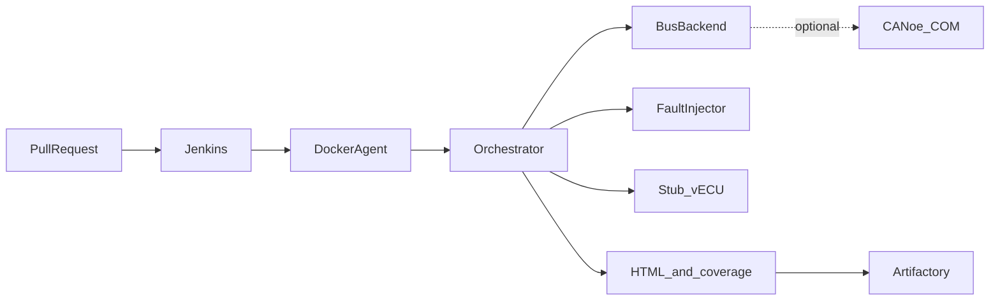

# SIL / Virtual ECU Automated Test Harness

HIL benches and target MCUs are always booked. This repo is a Software-in-the-Loop setup you can run on Linux or WSL so regression does not wait on hardware.

It spins up a stub AUTOSAR BSW stack (COM / PduR / CanIf) plus a small J1939 app, drives CAN traffic from Python (or CANoe on Windows if you have it), injects faults on every PR, and dumps HTML reports + gcov coverage into Artifactory.

Stack: **Docker · Jenkins · Python · CMake/GTest/gcov · optional Vector CANoe**

---

## Architecture at a glance



Deeper diagrams (sequence, BSW layers, publish path): **[docs/architecture.md](docs/architecture.md)**  
Frame / TCP / artifact flow: **[docs/data-flow.md](docs/data-flow.md)**

---

## What it does on a PR

1. Build the stub vECU with coverage flags and run GTest  
2. Run three SIL scenarios: frame drop, bus-off, J1939 TP retransmit  
3. Write an HTML report and coverage summary  
4. Publish artifacts (mock FS locally, real Artifactory in CI)  
5. Fail the build if pass rate or coverage dips below `config/harness.yaml`

---

## Quick start

```bash
python3 -m venv .venv
source .venv/bin/activate          # Windows: .venv\Scripts\activate
pip install -e ".[dev]"
bash scripts/run_local.sh
```

Report lands at `artifacts/reports/sil_report.html`.

Docker (same flow inside the CI image):

```bash
docker compose -f docker/docker-compose.yml run --rm sil-ci
```

### Path tip

If your checkout path has spaces or colons, CMake/make can choke. Symlink around it:

```bash
ln -sfn "$PWD" /tmp/sil-vecu-harness
cd /tmp/sil-vecu-harness
bash scripts/run_local.sh
```

---

## CLI

```bash
sil-harness run --config config/harness.yaml --scenarios all
sil-harness report --config config/harness.yaml
sil-harness publish --config config/harness.yaml --branch feature/xyz
```

| Flag | Meaning |
|------|---------|
| `--skip-build` | Reuse an existing `vecu/build` |
| `--skip-vecu` | Bus-only; do not start the C binary |
| `--no-gate` | Do not exit non-zero on coverage/pass-rate thresholds |
| `--scenarios frame_drop,bus_off` | Run a subset |

---

## Repo layout

```
config/           harness + scenario YAML          → config/README.md
src/sil_harness/  Python package                   → src/sil_harness/README.md
vecu/             stub C BSW + J1939 + GTest       → vecu/README.md
canoe/            sample CAPL                      → canoe/README.md
docker/           CI image + Jenkins               → docker/README.md
scripts/          local run / coverage             → scripts/README.md
tests/            Python unit + integration        → tests/README.md
docs/             architecture, CI, scenarios, …
```

---

## Configuration

Main knobs: [`config/harness.yaml`](config/harness.yaml)

- `backend: python` (default) or `canoe`
- pass-rate / line / branch coverage gates
- Artifactory `mode: mock | http`
- scenario list

Scenario YAML lives under `config/scenarios/`. See [docs/scenarios.md](docs/scenarios.md).

---

## CANoe (optional)

Linux CI always uses the Python bus. On a Windows/WSL agent with Vector CANoe + `pywin32`:

1. Set `backend: canoe` in `config/harness.yaml`
2. Point your CANoe cfg at [`canoe/FaultInjection.can`](canoe/FaultInjection.can) if you want CAPL-side drops

If COM attach fails, the harness logs a warning and falls back to Python. More: [docs/canoe.md](docs/canoe.md).

---

## Jenkins

Point a Pipeline job at the root [`Jenkinsfile`](Jenkinsfile). The agent builds from `docker/Dockerfile.ci`.

For real Artifactory uploads, set `artifactory.mode: http` and add Jenkins credentials ID `artifactory-sil`.

Details: [docs/jenkins.md](docs/jenkins.md).

---

## Tests

```bash
pytest tests/unit -q
pytest tests/integration -q

cmake -S vecu -B vecu/build -G Ninja -DCOVERAGE=ON -DBUILD_TESTS=ON
cmake --build vecu/build -j
./vecu/build/vecu_tests
```

See [docs/testing.md](docs/testing.md).

---

## Documentation

| Doc | Contents |
|-----|----------|
| [docs/architecture.md](docs/architecture.md) | System / sequence / BSW diagrams |
| [docs/data-flow.md](docs/data-flow.md) | Frames, TCP commands, artifacts |
| [docs/scenarios.md](docs/scenarios.md) | Fault injection reference |
| [docs/jenkins.md](docs/jenkins.md) | CI stages and credentials |
| [docs/testing.md](docs/testing.md) | Test pyramid and coverage |
| [docs/canoe.md](docs/canoe.md) | Optional CANoe path |
| [CONTRIBUTING.md](CONTRIBUTING.md) | Local workflow / PR checklist |

Index: [docs/README.md](docs/README.md)

---

## License

Internal / project use unless noted otherwise. Swap in your org license as needed.
