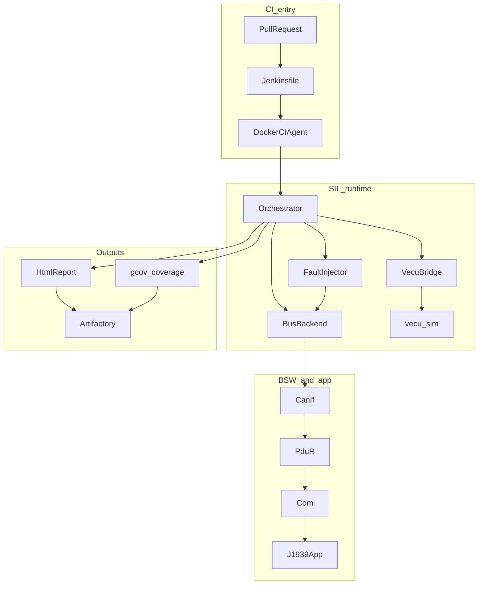
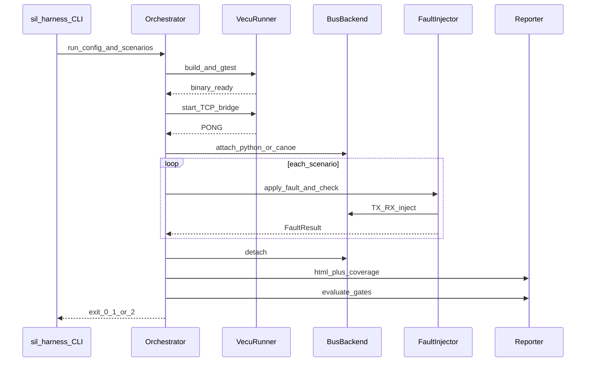
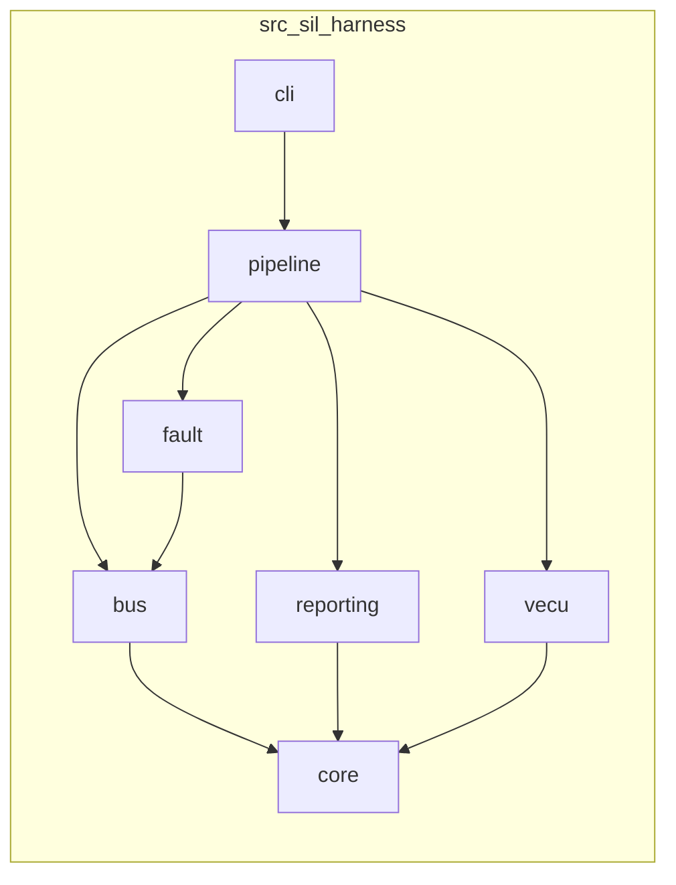
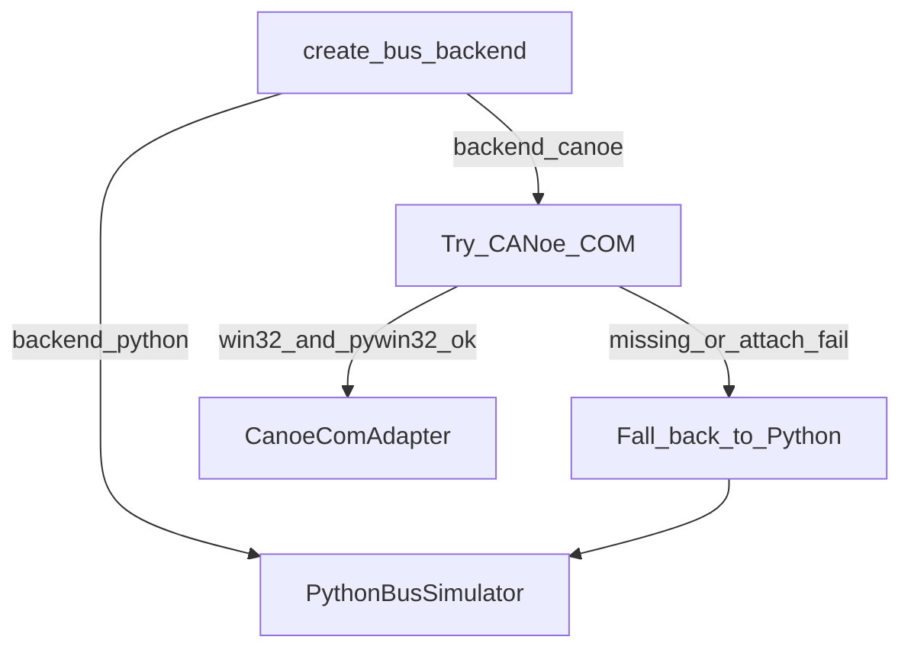
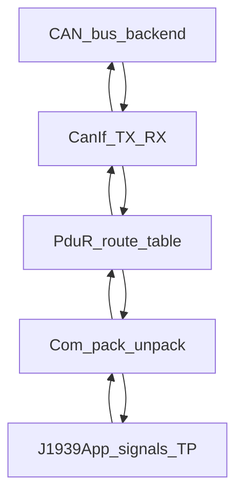
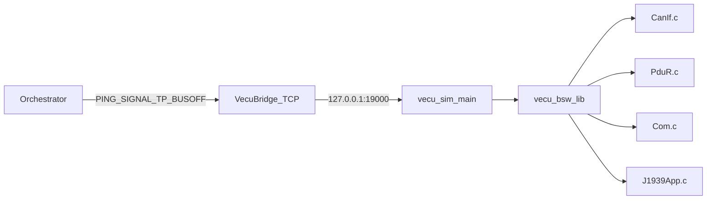
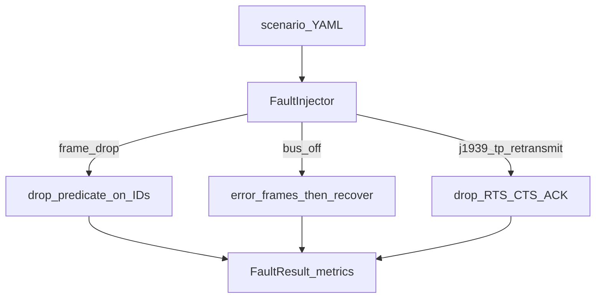
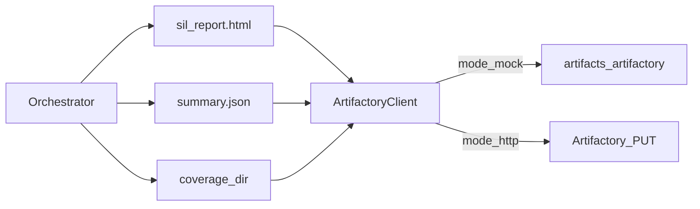

# Architecture

This harness exists so teams can run CAN/J1939 regression without waiting on a HIL rack. Jenkins starts a Docker agent, builds a stub vECU, Python (or CANoe) drives the bus, faults get injected, and results land in Artifactory with coverage.

## System overview

## End-to-end sequence

What happens when you run `sil-harness run` (same path Jenkins uses):

## Component map

| Package | What it owns |
|---------|----------------|
| `core/` | YAML config models, logging, retries, exception types |
| `bus/` | `BusBackend` protocol, Python sim, CANoe COM adapter, COM/PduR/CanIf/J1939 TP |
| `fault/` | Scenario fault application + pass/fail metrics |
| `vecu/` | CMake build, process lifecycle, TCP bridge |
| `pipeline/` | Orchestrator: load → run → report → gate → publish |
| `reporting/` | HTML report, gcov/lcov helpers, Artifactory clients |
| `cli.py` | `run` / `report` / `publish` entrypoints |

## Bus backend choice

Linux CI always ends up on the Python simulator. Windows/WSL agents with Vector CANoe can set `backend: canoe` in `config/harness.yaml`.

## AUTOSAR-ish data path

Same layering on both sides: Python wrappers for SIL injection, and the C stub under `vecu/` for coverage.

Default routing table (PDU ID → CAN ID):

| PDU ID | CAN ID | Use |
|--------|--------|-----|
| 1 | `0x18EAFF00` | Request |
| 2 | `0x18ECFF00` | TP.CM |
| 3 | `0x18EBFF00` | TP.DT |
| 4 | `0x18FF1200` | App PDU |

## Stub vECU process

`main.c` is only the control plane. Business logic stays in the static library so GTest can link the same objects the sim uses.

## Fault injection

Details and YAML fields: [scenarios.md](scenarios.md).

## Reporting and publish

Quality gates (pass rate, line/branch coverage) are read from `config/harness.yaml` → `thresholds`. Exit code `2` means a gate failed; `1` means one or more scenarios failed.

## Design choices that matter day-to-day

- **Swappable bus** — keep Linux green without a CANoe license; Windows can still attach COM when available.
- **Separate C binary** — coverage and GTest stay close to real ECU build habits; Python does not get linked into the “ECU”.
- **YAML scenarios** — fault knobs live next to the PR checklist, not buried in code.
- **Mock Artifactory** — laptop runs produce the same artifact layout CI would upload.
