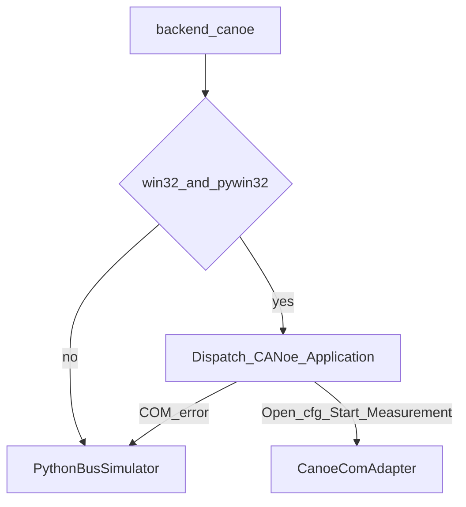

# CANoe integration (optional)

Default CI path does **not** need Vector CANoe. Use this only on Windows/WSL agents that already have a license and a cfg.

## When to use it

- You want CAPL-side fault hooks that match production benches
- You already maintain a CANoe configuration for the same network

Otherwise keep `backend: python` in `config/harness.yaml`.

## Attach flow

Implementation: `src/sil_harness/bus/canoe_adapter.py`.

## CAPL sample

[`canoe/FaultInjection.can`](../canoe/FaultInjection.can) listens for SIL sysvars and can drop TP.CM / selected IDs. Wire it into your CANoe cfg, then start Measurement via COM (the adapter calls `Measurement.Start()` when attach succeeds).

Suggested sysvars (define in your cfg to match the CAPL):

- `sysvar::SIL::EnableFrameDrop`
- `sysvar::SIL::ForceBusOff`
- `sysvar::SIL::TpControlDrops`

## Practical split

| Environment | Backend | Notes |
|-------------|---------|-------|
| Linux Docker agent | `python` | PR gate |
| Dev laptop Linux/macOS | `python` | no license needed |
| Windows CANoe PC | `canoe` | falls back if COM fails |
