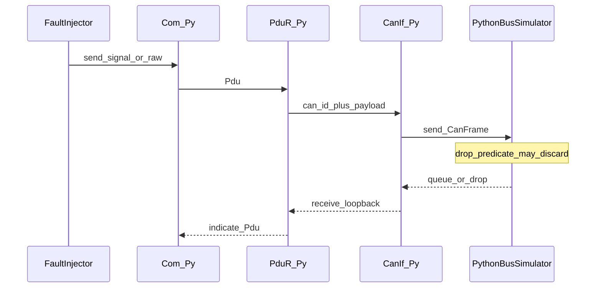
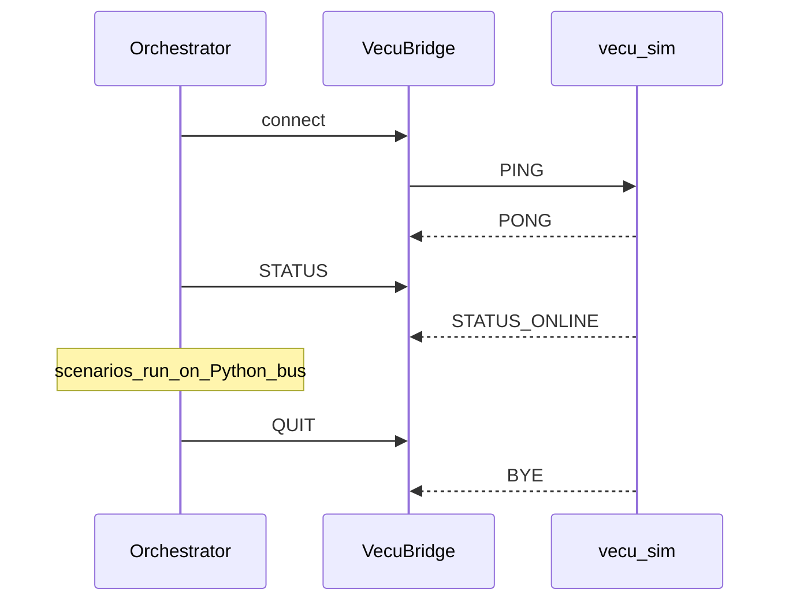
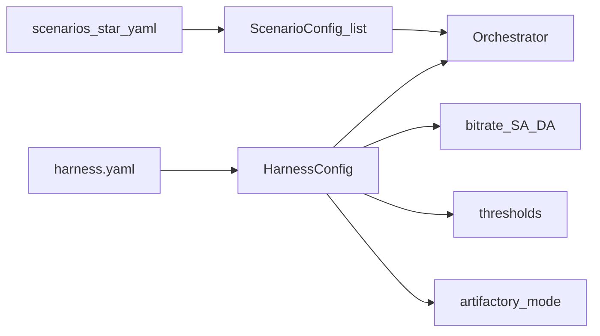

# Data flow

How frames, commands, and artifacts move through a single `sil-harness run`.

## Frame path during a scenario



## vECU control-plane commands

The orchestrator talks to `vecu_sim` over TCP (default `127.0.0.1:19000`).

| Command | Response | Purpose |
|---------|----------|---------|
| `PING` | `PONG` | readiness check |
| `SIGNAL <name> <value>` | `OK` / `ERR` | exercise Com TX |
| `TP <len>` | `OK delivered=…` | multi-frame J1939 send |
| `BUSOFF` / `RECOVER` | `OK` | force CanIf status |
| `STATUS` | `STATUS ONLINE\|BUS_OFF …` | counters |
| `QUIT` | `BYE` | close session |



Today the heavy fault traffic runs on the Python bus stack. The vECU process is still started so startup, IPC, and GTest/coverage stay in the same pipeline you would use with a fuller ECU image later.

## Artifact layout after a run

```
artifacts/
  reports/
    sil_report.html      # human-readable SIL report
    summary.json         # machine-readable + gate flags
  coverage/
    coverage.info        # lcov or synthesized
    index.html           # simple coverage page
  artifactory/           # only when mode=mock
    <branch>/<build>/
      sil_report.html
      summary.json
      coverage/
```

## Config → runtime binding


