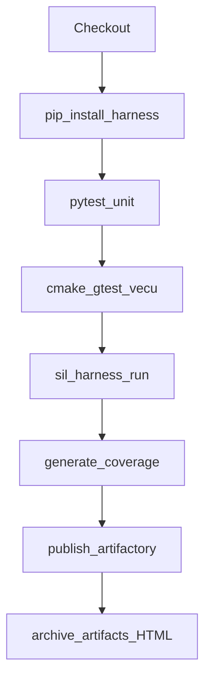
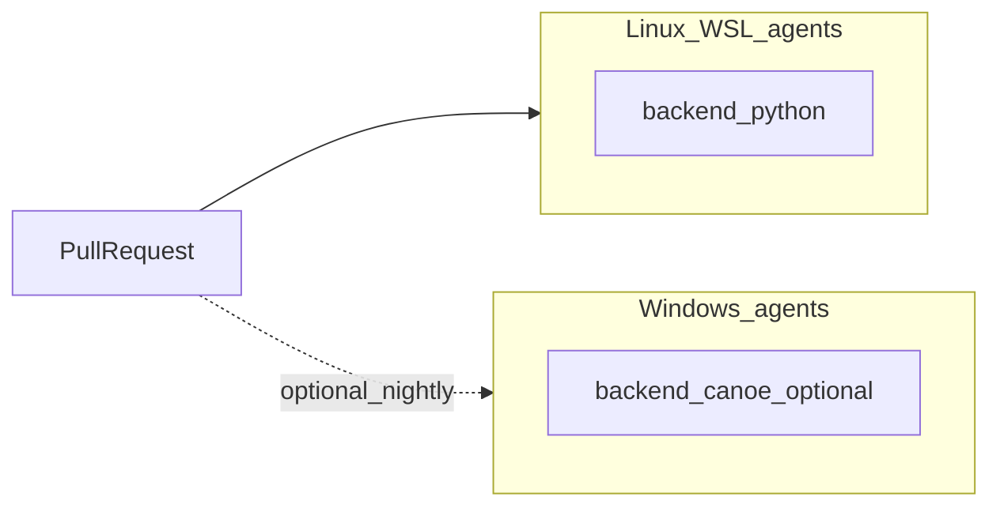

# Jenkins

## Pipeline shape



The agent is built from [`docker/Dockerfile.ci`](../docker/Dockerfile.ci) via the `dockerfile` agent block in the root `Jenkinsfile`.

## Job setup

1. Create a Multibranch Pipeline (or single Pipeline) against this repo.
2. Ensure agents can run Docker (Docker-outside-of-Docker or sibling socket — lab setups often mount `docker.sock`).
3. For HTTP Artifactory, add credentials ID `artifactory-sil` (username/password → `ARTIFACTORY_USER` / `ARTIFACTORY_PASSWORD`).
4. Leave `artifactory.mode: mock` until the real endpoint is ready; publish still produces a local tree under `artifacts/artifactory/`.

## Credentials matrix

| When | Jenkins credentials ID | Env vars |
|------|------------------------|----------|
| `mode: http` in harness.yaml | `artifactory-sil` | `ARTIFACTORY_USER`, `ARTIFACTORY_PASSWORD` |
| `mode: mock` (default) | none | — |

## Local Jenkins controller (optional)

```bash
docker compose -f docker/docker-compose.yml --profile jenkins up -d jenkins
# UI: http://localhost:8080
```

Treat socket-mounted Docker as a laptop convenience, not a hardened prod controller.

## WSL / Windows split



Keep PR gates on Linux + Python bus. Use a Windows node only if you need real CANoe COM / CAPL.

## Exit codes from `sil-harness run`

| Code | Meaning |
|------|---------|
| 0 | all scenarios passed and gates OK |
| 1 | one or more scenarios failed |
| 2 | quality gate failed (pass rate / coverage) |

`--no-gate` skips the exit-2 path; useful when debugging a single scenario locally.
