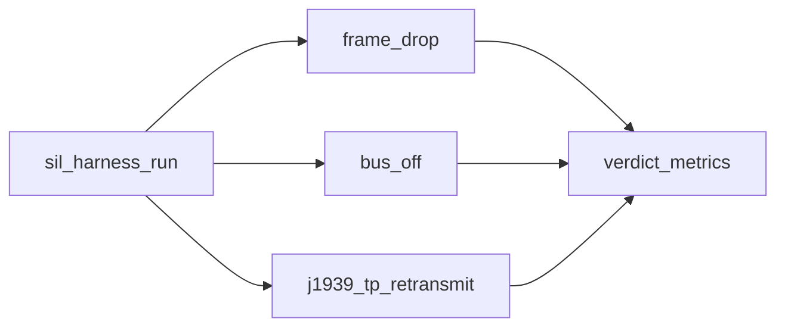
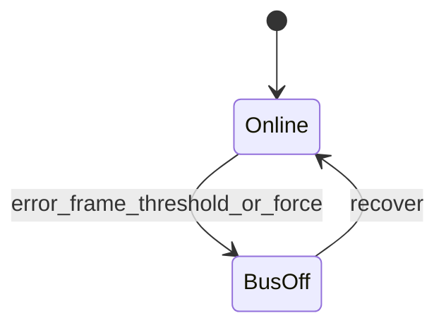
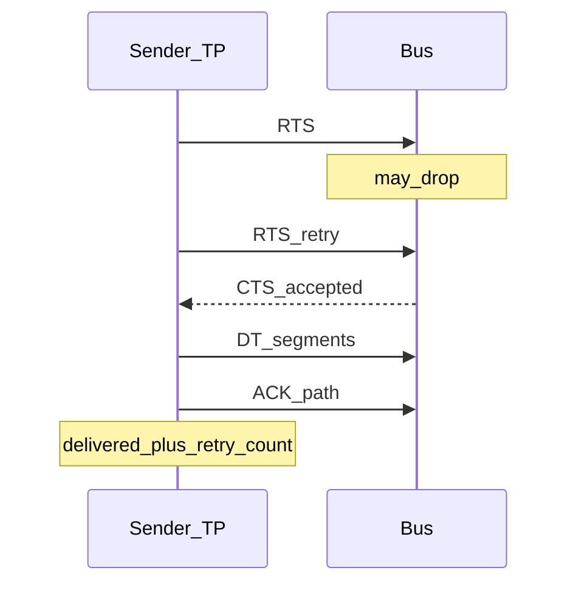

# Fault injection scenarios

Scenarios are YAML under `config/scenarios/`. `config/harness.yaml` lists which ones run on a PR (override with `--scenarios`).

## Scenario set

## frame_drop

Drops a fraction of frames for selected CAN IDs during a short window, then checks that some traffic still got through and the bus is not stuck offline.

| Field | Meaning |
|-------|---------|
| `fault.drop_rate` | 0.0–1.0 probability while the window is open |
| `fault.can_ids` | extended IDs to target; empty means any ID |
| `fault.window_ms` | how long the drop predicate stays armed |
| `expectations.min_frames_received` | lower bound on RX after the burst |
| `expectations.max_drop_ratio` | upper bound on dropped/sent |
| `expectations.require_recovery` | bus must not remain bus-off |

File: [`config/scenarios/frame_drop.yaml`](../config/scenarios/frame_drop.yaml)

## bus_off

Pumps error frames (or forces bus-off), recovers, and checks we came back inside `max_recovery_ms`.

File: [`config/scenarios/bus_off.yaml`](../config/scenarios/bus_off.yaml)

## j1939_tp_retransmit

Sends a multi-frame payload with CMDT-style RTS / CTS / ACK. The injector drops a few control frames so the TP layer has to retry.

| Field | Meaning |
|-------|---------|
| `fault.drop_control_frames` | how many TP.CM-like controls to eat |
| `fault.max_tp_retries` | abort after this many attempts |
| `fault.payload_bytes` | message size (>8 forces segmentation) |
| `expectations.require_retransmit` | at least one retry required |
| `expectations.require_delivery` | final payload must land |
| `expectations.max_retries_observed` | cap on retries |

File: [`config/scenarios/j1939_tp_retransmit.yaml`](../config/scenarios/j1939_tp_retransmit.yaml)

## Adding a scenario

1. Add `config/scenarios/<name>.yaml`
2. Handle the fault type in `FaultInjector.apply` (or reuse an existing type)
3. List the name under `scenarios:` in `harness.yaml`
4. Add a focused unit test under `tests/unit/`

Keep scenarios short — `thresholds.scenario_timeout_sec` is a hard wall-clock check after each apply.
