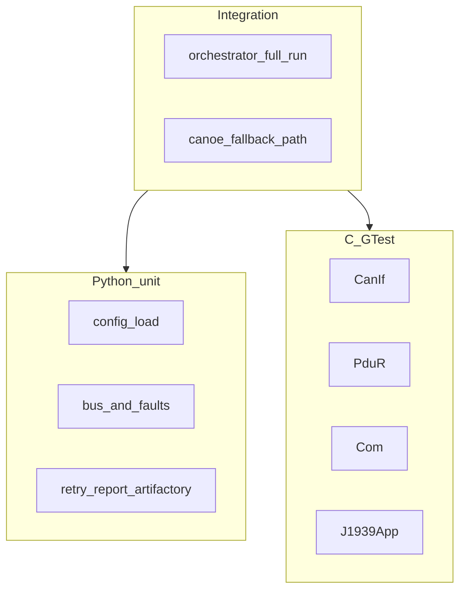

# Testing

Three layers: Python unit, C GTest on the stub BSW, and a Python integration path that boots the orchestrator.

## Pyramid



## Commands

```bash
# Python
pytest tests/unit -q
pytest tests/integration -q

# C (from repo root; prefer Ninja if available)
cmake -S vecu -B vecu/build -G Ninja -DCOVERAGE=ON -DBUILD_TESTS=ON
cmake --build vecu/build -j
./vecu/build/vecu_tests

# everything a laptop usually needs
bash scripts/run_local.sh
```

## What each layer covers

| Layer | Location | Focus |
|-------|----------|--------|
| Python unit | `tests/unit/` | config errors, bus drop/bus-off/TP, retries, HTML, mock Artifactory |
| C GTest | `vecu/tests/` | loopback TX/RX, routing, signal pack, TP segment counts, app branches |
| Integration | `tests/integration/` | full orchestrator against a built `vecu_sim`, publish path |

## Coverage

- CMake `-DCOVERAGE=ON` adds `--coverage` to the BSW library.
- `scripts/generate_coverage.sh` prefers `lcov` / `gcovr`, then falls back to the harness synthesizer so CI always has an HTML stub to publish.
- Gates: `thresholds.min_line_coverage` / `min_branch_coverage` in `config/harness.yaml`.

## Edge cases we already exercise

- Empty scenario list → `ConfigError`
- CANoe requested on non-Windows → automatic Python fallback
- Artifactory mock missing file → `PublishError`
- J1939 TP control-frame drops → retries then delivery (or abort after max)
