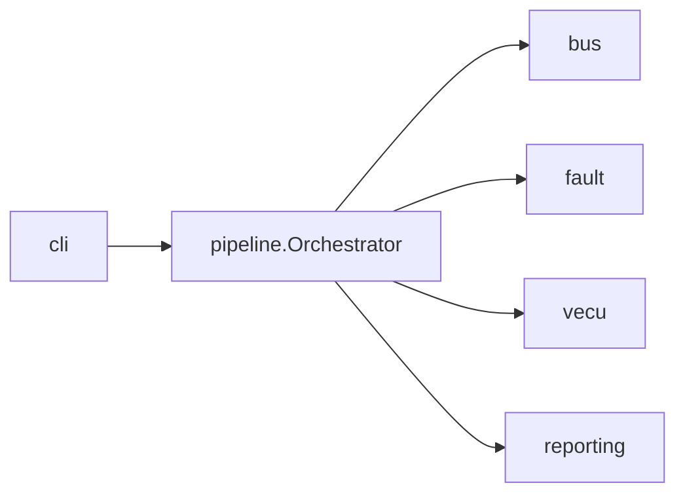

# `sil_harness` Python package

Installable package that drives SIL runs from the CLI or Jenkins.

```bash
pip install -e ".[dev]"
sil-harness run --config config/harness.yaml --scenarios all
```

## Layout

```
sil_harness/
  cli.py           # click entry: run | report | publish
  core/            # config, logging, retry, errors
  bus/             # BusBackend + COM/PduR/CanIf/J1939
  fault/           # scenario fault injector
  vecu/            # build/start stub ECU + TCP bridge
  pipeline/        # Orchestrator
  reporting/       # HTML, coverage, Artifactory
```

## Mental model



See [docs/architecture.md](../../docs/architecture.md) for the full diagrams.
