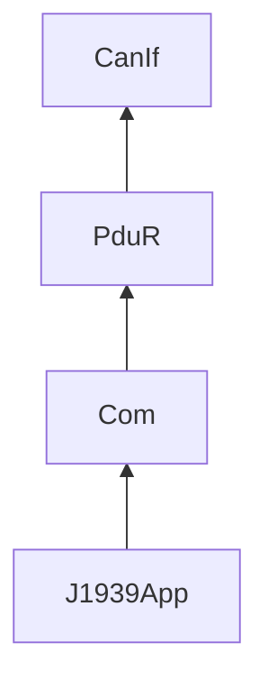

# Stub vECU (`vecu/`)

C stand-in for AUTOSAR BSW + a tiny J1939 app. Built with CMake, tested with GTest, instrumented with gcov when `-DCOVERAGE=ON`.

## Targets

| Target | Role |
|--------|------|
| `vecu_bsw` | static lib: CanIf, PduR, Com, J1939App |
| `vecu_sim` | TCP control-plane binary (default port 19000) |
| `vecu_tests` | GTest suite against the same lib |

## Build

```bash
cmake -S vecu -B vecu/build -G Ninja -DCOVERAGE=ON -DBUILD_TESTS=ON
cmake --build vecu/build -j
./vecu/build/vecu_tests
./vecu/build/vecu_sim 19000   # optional manual start
```

If the absolute path to the repo has spaces or colons, symlink to something like `/tmp/sil-vecu-harness` first — Make/Ninja shell rules get unhappy otherwise.

## Layering



TCP commands accepted by `main.c` are listed in [docs/data-flow.md](../docs/data-flow.md).
